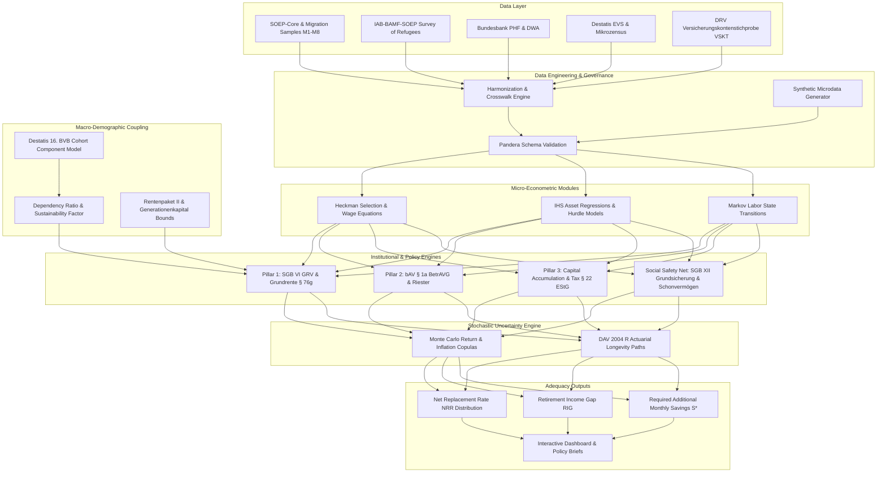
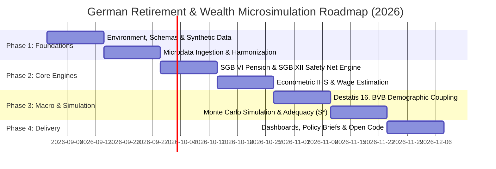

# Research Design & Dynamic Microsimulation Blueprint: Wealth Accumulation, Migration & Retirement Sustainability in Germany (2025–2070)

**Working Version:** August 2026  
**Subject:** Empirical Wealth Economics, Migration Dynamics, and Pension Policy Microsimulation  
**Target Geographical & Institutional Scope:** Federal Republic of Germany (SGB VI, SGB XII, EStG, Destatis 16. BVB)

---

## Executive Summary & System Architecture

This document provides the formal mathematical, institutional, econometric, and computational specifications for analyzing individual wealth trajectories, public pension entitlements, and long-term retirement adequacy across distinct population segments in Germany up to 2070.



---

## 1. Formal Research Questions & Hypotheses

### 1.1. Core Research Question
$$\begin{aligned}
\text{Given } & \mathbf{X}_i = \{\text{Age}_i, \text{Wage}_i(t), \text{MigrationGroup}_i, \text{YearsInDE}_i, \text{HumanCapital}_i, \text{Housing}_i, \text{Family}_i\}, \\
& \text{and macroeconomic trajectories } \boldsymbol{\Theta}_t = \{\text{Demography}_t, \text{SustainabilityFactor}_t, r_t, \pi_t\}, \\
\text{estimate } & P\left(\text{NetRetirementIncome}_i(\text{Age}_{R,i}) \ge \tau_k \mid \mathbf{X}_i, \boldsymbol{\Theta}_t\right) \quad \text{for adequacy thresholds } \tau_k.
\end{aligned}$$

### 1.2. Scientific Hypotheses
* **$H_1$ (Initial Wealth Gap):** First-generation immigrants exhibit significantly lower initial financial liquid and invested wealth compared to natives with identical age and formal qualification upon arrival ($p < 0.01$).
* **$H_2$ (Assimilation Curve):** The financial wealth gap narrows logarithmically with respect to duration of residence in Germany ($\text{YearsInDE}$), but fails to converge to zero for cohorts arriving after age 35.
* **$H_3$ (Refugee & Deskilling Penalty):** Refugee cohorts face a steeper initial wealth deficit driven by mandatory waiting periods, lack of initial liquidity, and formal qualification mismatch, which is mitigated only upon official degree recognition (*BQFG*).
* **$H_4$ (Ukrainian Cohort Dynamics):** Displaced Ukrainian persons arriving under § 24 AufenthG demonstrate high labor supply responsiveness to language acquisition ($B2+$), but net asset accumulation is constrained in the medium term by high dependent-care ratios (female-headed single households) and remittances.
* **$H_5$ (Late Arrival Longevity Risk):** Individuals arriving in Germany at age $\ge 45$ have a probability exceeding $65\%$ of requiring *Grundsicherung im Alter* (SGB XII) unless foreign pension rights are portable.
* **$H_6$ (Housing Status Asymmetry):** Lifetime renters face an increased risk of retirement poverty of $\approx 40\%$ compared to debt-free owner-occupiers due to escalating housing and heating costs (*Kosten der Unterkunft - KdU*).
* **$H_7$ (Macro Demographic Feedback):** Automatic adjustments via the statutory Sustainability Factor (*Nachhaltigkeitsfaktor*) reduce the real value of the pension point by $12\text{--}18\%$ by 2050 under adverse demographic scenarios, increasing retirement shortfalls across all cohorts.

---

## 2. German Institutional & Social Security Systems

### 2.1. Pillar 1: Statutory Pension Insurance (*Gesetzliche Rentenversicherung - SGB VI*)

The gross monthly statutory retirement pension ($R_{\text{brutto}, i}$) is governed by:

$$R_{\text{brutto}, i} = \left( \sum_{t=t_{\text{entry}}}^{t_R} \text{EP}_{i,t} + \text{EP}_{\text{childcare}, i} + \text{EP}_{\text{care}, i} + \Delta\text{EP}_{\text{Grundrente}, i} \right) \times \text{ZF}_i \times \text{AR}(t_R) \times \text{RAF}$$

Where:
1. **Individual Earnings Points ($\text{EP}_{i,t}$):**
   $$\text{EP}_{i,t} = \frac{\min\left(\text{GrossWage}_{i,t}, \text{BBG}_t\right)}{\text{Durchschnittsentgelt}_t}$$
   * $\text{BBG}_t$: Annual statutory contribution ceiling (*Beitragsbemessungsgrenze*).
   * $\text{Durchschnittsentgelt}_t$: Official average wage of all insured workers.
2. **Access Factor ($\text{ZF}_i$):**
   $$\text{ZF}_i = 1.0 - 0.003 \times \max(0, \text{MonthsEarly}_i) + 0.005 \times \max(0, \text{MonthsLate}_i)$$
   * Early retirement penalty: $-3.6\%$ per year (maximum $-14.4\%$).
   * Delayed retirement bonus: $+6.0\%$ per year.
3. **Current Pension Value ($\text{AR}_t$):**
   $$\text{AR}_t = \text{AR}_{t-1} \times \frac{\bar{w}_{t-1}}{\bar{w}_{t-2}} \times \left[ \alpha \times \left(1 - \text{BS}_{t-1}\right) + (1-\alpha) \right] \times \left[ \left(1 - \frac{\text{SDR}_{t-1}}{\text{SDR}_{t-2}}\right) \times \beta + 1 \right]$$
   * $\text{BS}_t$: Contribution rate (*Beitragssatz*).
   * $\text{SDR}_t$: System Dependency Ratio ($\frac{\text{Pensioners}_t}{\text{Contributors}_t}$).
   * $\beta$: Sustainability factor weighting parameter ($\beta = 0.25$).
4. **Basic Pension Supplement (*Grundrente nach § 76g SGB VI*):**
   * Threshold: $\ge 33$ years of *Grundrentenzeiten* (employment, child-rearing, long-term caregiving).
   * Uplift applies to years with $0.3 \le \text{EP}_t \le 0.8$, with a maximum uplift capped at $\approx 0.8\,\text{EP}/\text{year}$ subject to full income testing (*Einkommensprüfung*).

### 2.2. Safety Net: *Grundsicherung im Alter* (SGB XII, Chapter 4)

For individuals whose aggregate income fails to meet socio-cultural minimum subsistence:

$$\text{Bedarf}_{\text{SGB XII}, i} = \text{Regelbedarf}(\text{Stufe}_i) + \text{KdU}_i + \text{Mehrbedarfe}_i$$

$$\text{Grundsicherungsleistung}_i = \max\left(0, \text{Bedarf}_{\text{SGB XII}, i} - \text{Income}_{\text{countable}, i}\right)$$

* **Asset Protection (*Schonvermögen* § 90 SGB XII):** Liquid assets up to €10,000 (single) / €20,000 (couple) are exempt, as well as an appropriate owner-occupied property.
* **Statutory Pension Exemption (*Freibetrag § 82a SGB XII*):** For retirees with $\ge 33$ contribution years, an exemption of up to $50\%$ of *Regelbedarfsstufe 1* (max. €281/month) is deducted before means-testing.

### 2.3. Net Post-Retirement Cash Flows

$$\text{NetRetirementIncome}_i = R_{\text{brutto}, i} + \text{bAV}_{i} + \text{PrivatePayout}_i + \text{Grundsicherung}_i - \text{Taxes}_i - \text{KVdR}_i - \text{PV}_i$$

* **Health Insurance for Pensioners (*KVdR*):** $7.3\% + \frac{\text{Zusatzbeitrag}_k}{2}$.
* **Long-Term Care Insurance (*PV*):** $3.4\%$ (with children) to $4.0\%$ (childless).
* **Deferred Taxation (*Nachgelagerte Besteuerung* § 22 EStG):** Taxable portion determined by cohort entry year, phased to $100\%$.

---

## 3. Microdata Taxonomy & Population Cohorts

| Cohort Code | Population Segment | Legal Basis | Key Defining Characteristics |
|:---|:---|:---|:---|
| **A** | German Reference Population | German Citizenship at birth | Native-born, uninterrupted domestic history, baseline comparison |
| **B** | Economic / EU / 3rd Country Migrants (1st Gen) | AufenthG / EU Freedom of Movement | Foreign-born, economic labor market entry, variable age at arrival |
| **C** | 2nd Generation Migrants | Native-born with migration background | Educated in German system, intergenerational asset transfers |
| **D** | Historical Refugees (2013–2016 waves) | AsylG / Geneva Convention | High proportion male at arrival, prolonged integration trajectories |
| **E** | Displaced Ukrainians (2022+) | § 24 AufenthG / Temporary Protection | High share female ($>65\%$), single caregivers, high formal education |
| **F** | Pre-2022 Ukrainian Migrants | AufenthG | Economic/academic migrants prior to Feb 2022, established integration |

---

## 4. Econometric Architecture

### 4.1. Wealth Modeling: Inverse Hyperbolic Sine & Two-Part Hurdle Models

To handle extreme skewness, zero holdings, and negative net worth:

$$\text{IHS}(W_i, \theta) = \frac{\ln\left(\theta W_i + \sqrt{\theta^2 W_i^2 + 1}\right)}{\theta}, \quad \theta = 1$$

Asset-specific participation and conditional amounts are estimated via Two-Part Models:

$$\begin{aligned}
\text{Part 1 (Participation):} \quad & P(A_{j,i} > 0 \mid \mathbf{X}_i) = \Phi(\mathbf{X}_i \boldsymbol{\gamma}_j) \\
\text{Part 2 (Conditional Value):} \quad & \mathbb{E}[\text{IHS}(A_{j,i}) \mid A_{j,i} > 0, \mathbf{X}_i] = \mathbf{X}_i \boldsymbol{\beta}_j
\end{aligned}$$

### 4.2. Mincerian Wage Dynamics with Deskilling Penalties

$$\ln(\text{Wage}_{it}) = \alpha_0 + \alpha_1 \text{Exp}_{\text{DE}, it} + \alpha_2 \text{Exp}_{\text{DE}, it}^2 + \alpha_3 \text{Exp}_{\text{Foreign}, it} + \sum_{l \in \text{CEFR}} \delta_l \text{Lang}_{lit} - \lambda \text{Deskilling}_{it} + \mathbf{Z}_{it}\boldsymbol{\beta} + \mu_i + \epsilon_{it}$$

* $\text{Deskilling}_{it} = \max(0, \text{ISCED}_{\text{Origin}, i} - \text{KldB}_{\text{Job}, it})$.

---

## 5. Adequacy & Policy Indicators

1. **Net Replacement Rate ($\text{NRR}_i$):**
   $$\text{NRR}_i = \frac{\text{NetRetirementIncome}_i}{\frac{1}{5}\sum_{k=1}^5 \text{NetPreRetirementIncome}_{i, t_R - k}}$$
2. **Retirement Income Gap ($\text{RIG}_i$):**
   $$\text{RIG}_i = \max\left(0, \tau_{\text{target}} \times \text{NetPreRetirementIncome}_i - \text{ProjectedNetRetirementIncome}_i\right)$$
3. **Required Additional Monthly Savings ($S_i^*$):**
   $$S_i^* = \frac{\text{RIG}_i \times \ddot{a}_{\overline{K_i}|}(r_{\text{post}})}{s_{\overline{t_R - t_0}|}(r_{\text{pre}})}$$

---

## 6. Software Architecture & Reproducibility Pipeline

```
germany_wealth_migration_retirement/
|-- 00_admin/
|-- 01_sources/
|-- 02_raw_data/
|-- 03_synthetic_data/
|-- 04_processed/
|-- 05_engine/
|   |-- config.py
|   |-- schemas.py
|   |-- markov_labor_transitions.py
|   |-- wage_equations.py
|   |-- grv_pension_calculator.py
|   |-- sgb_xii_safety_net.py
|   |-- wealth_accumulation.py
|   |-- demographic_projection.py
|   |-- monte_carlo_simulator.py
|   |-- adequacy_evaluator.py
|-- 06_models_econometrics/
|-- 07_tests/
|-- 08_outputs/
|-- 09_reproducibility/
```

---

## 7. Quality Assurance & Implementation Roadmap


